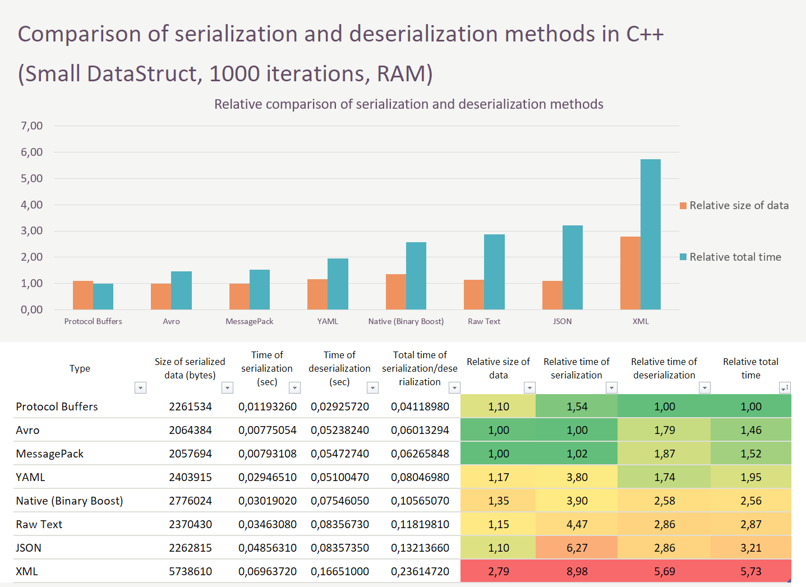
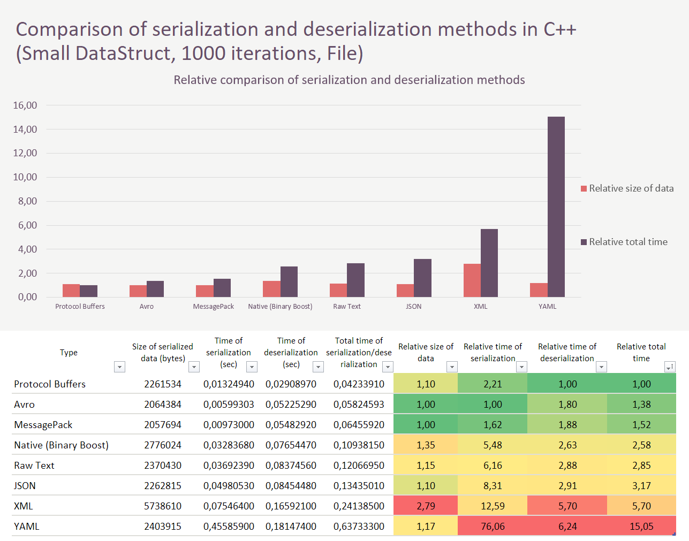

# C++ Serializers
## About
This is an application which compares different serialization and deserialization methods in C++ runtime. 
The list of methods:

+ [Binary (Boost)*](http://www.boost.org/libs/serialization)
+ [XML (Boost)](http://www.boost.org/libs/serialization)
+ [JSON (Boost)](http://www.boost.org/libs/json)
+ [Raw Text (Boost)](http://www.boost.org/libs/serialization)
+ [YAML (rapidyaml)](https://github.com/biojppm/rapidyaml)
+ [Google Protocol Buffers](https://developers.google.com/protocol-buffers)
+ [Apache Avro](http://avro.apache.org/)
+ [MessagePack](https://github.com/msgpack/msgpack-c/tree/cpp_master)

**Binary (Boost) methods of serialization and deserialization were chosen instead of native serialization with C++.*

As an example of data structure which is serialized and deserialized the following struct was implemented:

```cpp
struct DataStruct {
    std::string str;
    int int_num;
    double double_num;
    std::vector<int> v_int;
    std::map<std::string, std::string> map_str_str;
    std::map<std::string, std::map<std::string, int>> map_map;
    std::map<std::string, std::vector<std::map<std::string, std::string>>> map_vector_map;
}

enum class StructSize {
    Small,
    Medium,
    Large
};
```

StructSize describes how large will be the following constants while generating DataStruct instance (defined in [struct.cpp](struct.cpp)):

```cpp
# Small
string_size = 20, vec_size = 40, map_size = 80, nested_map_size = 15;
# Medium
string_size = 100, vec_size = 130, map_size = 50, nested_map_size = 30;
# Large
string_size = 200, vec_size = 200, map_size = 100, nested_map_size = 50;
```

The serialization and deserialization run in two modes: using memory buffers and using files.

## Installation

### Build from sources

An application needs a compiler that supports C++14 features. Also application uses dependencies which should be installed if built from sources:

1) [Boost Library](https://www.boost.org/users/download/) (All header-only libraries and build separately - serialization, json, filesystem, iostreams, system, program_options, regex, chrono, timer)

2) [Google Protobuf Library](https://github.com/protocolbuffers/protobuf/tree/master/src)

3) [Apache Avro Library](http://avro.apache.org/releases.html#Download)

4) [Rapid YAML parser and emitter Library](https://github.com/biojppm/rapidyaml)

5) [MessagePack Library](https://github.com/msgpack/msgpack-c/tree/cpp_master)

After all the dependencies are installed:

```bash
git clone https://github.com/jellythefish/cpp_serializers.git
cd cpp_serializers
mkdir build
cd build
cmake ..
make
```

For beautiful output formatting it uses [tabulate](https://github.com/p-ranav/tabulate), but it is fetched and installed via CMake FetchContent.

TODO: to transfer all dependencies installations to CMakeLists.txt.

### Via Docker

It is much more easier to run docker container with all installed dependencies and uniformed environment. 

The [Docker](https://www.docker.com/products/docker-desktop) itself should already be installed in host OS.

There are two ways to get docker image of the application:

#### Build from Dockerfile

```bash
git clone https://github.com/jellythefish/cpp_serializers.git`
cd cpp_serializers
docker build . --no-cache -t cpp_serializers
```

Building of docker image takes ~30 min on my 32 GB RAM and i5 10600K 5.0 GHz PC. So it's a long way up. 

#### Pulling from Docker Hub

```bash
docker pull jellythefish/cpp_serializers
```

You will need approx. 1.5GB of free disk space to build or pull the docker image.

## Usage

Basically, you run application from build directory like:

```bash
./serialization SIZE ITER
```

Where, 

SIZE - is the required argument, representing the size of generated data structure. Should be one of [**small**, **medium**, **large**]. 

ITER - is the required argument, representing the number of serialize/deserialize iterations for each method.

For example,

```bash
./serialization small 1000
./serialization medium 100
./serilization large 10
```

(YAML serialization and deserialization to/from files takes very much time, so it is better to put as less iterations for large data structures as possible).

### Run docker container

To run application in docker container use (by default, SIZE = small, ITER = 10):

```bash
docker run --rm jellythefish/cpp_serializers
```

Or specifying arguments:

```bash
docker run --rm jellythefish/cpp_serializers medium 100
```

## Results

This is an example of the final output produced by application. This table represents **small** data structure with **1000 iterations** of serialization and deserialization run by each method:

|          Type           |       Operation       |  Place   |                 Time                  |                Memory                |
| :---------------------: | :-------------------: | :------: | :-----------------------------------: | :----------------------------------: |
|     Binary (Boost)      |     Serialization     |   RAM    |        30.1902 ms/0.0301902 s         |        2776024 b/2710 Kb/2 Mb        |
|     Binary (Boost)      |    Deserialization    |   RAM    |        75.4605 ms/0.0754605 s         |        2776024 b/2710 Kb/2 Mb        |
|       XML (Boost)       |     Serialization     |   RAM    |        69.6372 ms/0.0696372 s         |        5738610 b/5604 Kb/5 Mb        |
|       XML (Boost)       |    Deserialization    |   RAM    |          166.51 ms/0.16651 s          |        5738610 b/5604 Kb/5 Mb        |
|    Raw text (Boost)     |     Serialization     |   RAM    |        34.6308 ms/0.0346308 s         |        2370430 b/2314 Kb/2 Mb        |
|    Raw text (Boost)     |    Deserialization    |   RAM    |        83.5673 ms/0.0835673 s         |        2370430 b/2314 Kb/2 Mb        |
|      JSON (Boost)       |     Serialization     |   RAM    |        48.5631 ms/0.0485631 s         |        2262815 b/2209 Kb/2 Mb        |
|      JSON (Boost)       |    Deserialization    |   RAM    |        83.5735 ms/0.0835735 s         |        2262815 b/2209 Kb/2 Mb        |
|        Protobuf         |     Serialization     |   RAM    |        11.9326 ms/0.0119326 s         |        2261534 b/2208 Kb/2 Mb        |
|        Protobuf         |    Deserialization    |   RAM    |        29.2572 ms/0.0292572 s         |        2261534 b/2208 Kb/2 Mb        |
|          Avro           |     Serialization     |   RAM    |        7.75054 ms/0.00775054 s        |        2064384 b/2016 Kb/1 Mb        |
|          Avro           |    Deserialization    |   RAM    |        52.3824 ms/0.0523824 s         |        2064384 b/2016 Kb/1 Mb        |
|          YAML           |     Serialization     |   RAM    |        29.4651 ms/0.0294651 s         |        2403915 b/2347 Kb/2 Mb        |
|          YAML           |    Deserialization    |   RAM    |        51.0047 ms/0.0510047 s         |        2403915 b/2347 Kb/2 Mb        |
|       MessagePack       |     Serialization     |   RAM    |        7.93109 ms/0.00793108 s        |        2057694 b/2009 Kb/1 Mb        |
|       MessagePack       |    Deserialization    |   RAM    |        54.7274 ms/0.0547274 s         |        2057694 b/2009 Kb/1 Mb        |
|      -----       |      -----      | ----- |          -----          |         -----          |
|     Binary (Boost)      |     Serialization     |   File   |        32.8368 ms/0.0328368 s         |        2776024 b/2710 Kb/2 Mb        |
|     Binary (Boost)      |    Deserialization    |   File   |        76.5447 ms/0.0765447 s         |        2776024 b/2710 Kb/2 Mb        |
|       XML (Boost)       |     Serialization     |   File   |         75.464 ms/0.075464 s          |        5738610 b/5604 Kb/5 Mb        |
|       XML (Boost)       |    Deserialization    |   File   |         165.921 ms/0.165921 s         |        5738610 b/5604 Kb/5 Mb        |
|    Raw text (Boost)     |     Serialization     |   File   |        36.9239 ms/0.0369239 s         |        2370430 b/2314 Kb/2 Mb        |
|    Raw text (Boost)     |    Deserialization    |   File   |        83.7456 ms/0.0837456 s         |        2370430 b/2314 Kb/2 Mb        |
|      JSON (Boost)       |     Serialization     |   File   |        49.8053 ms/0.0498053 s         |        2262815 b/2209 Kb/2 Mb        |
|      JSON (Boost)       |    Deserialization    |   File   |        84.5448 ms/0.0845448 s         |        2262815 b/2209 Kb/2 Mb        |
|        Protobuf         |     Serialization     |   File   |        13.2494 ms/0.0132494 s         |        2261534 b/2208 Kb/2 Mb        |
|        Protobuf         |    Deserialization    |   File   |        29.0897 ms/0.0290897 s         |        2261534 b/2208 Kb/2 Mb        |
|          Avro           |     Serialization     |   File   |        5.99303 ms/0.00599303 s        |        2064384 b/2016 Kb/1 Mb        |
|          Avro           |    Deserialization    |   File   |        52.2529 ms/0.0522529 s         |        2064384 b/2016 Kb/1 Mb        |
|          YAML           |     Serialization     |   File   |         455.859 ms/0.455859 s         |        2403915 b/2347 Kb/2 Mb        |
|          YAML           |    Deserialization    |   File   |         181.474 ms/0.181474 s         |        2403915 b/2347 Kb/2 Mb        |
|       MessagePack       |     Serialization     |   File   |        9.73261 ms/0.00973262 s        |        2057694 b/2009 Kb/1 Mb        |
|       MessagePack       |    Deserialization    |   File   |        54.8292 ms/0.0548292 s         |        2057694 b/2009 Kb/1 Mb        |





### Conclusion

The analysis tables (RAM and File serialization/deserialization) show that Google Protocol Buffers has got minimal relative total time. Also, it has to produce the amount of data only 1,10 times larger than Avro and MessagePack what is quite good. So, Protocol Buffers is the best method among others if the low amount of time and memory spent on serialization and deserialization is crucial. On the contrary, never use XML as the serialization and deserialization method in any programming language. It ran out of efficiency nowadays due to its overloaded unnecessary tags.

### About poor time of YAML

Still, there are some questions to YAML library which makes yaml serialization and deserialization to/from files go for so long. I tried to implement yaml operations with [yamp-cpp](https://github.com/jbeder/yaml-cpp) instead of [rapidyaml](https://github.com/biojppm/rapidyaml), but it ran 10 times slower than rapidyaml. The author of rapidyaml states:

> .........................................................
>
> Why this library? Because none of the existing libraries was quite what I wanted. There are two C/C++ libraries that I know of:
>
> - [libyaml](https://github.com/yaml/libyaml)
> - [yaml-cpp](https://github.com/jbeder/yaml-cpp)
>
> ...........................................................
>
> (The results presented below are a bit scattered; and they need to be sistematized.) On a i7-6800K CPU @3.40GHz:
>
> - ryml parses YAML at about ~150MB/s on Linux and ~100MB/s on Windows (vs2017).
> - **ryml parses JSON at about ~450MB/s on Linux**, faster than sajson (didn't try yet on Windows).
> - compared against the other existing YAML libraries for C/C++:
>   - ryml is in general between **2 and 3 times** faster than [libyaml](https://github.com/yaml/libyaml)
>   - ryml is in general between **20 and 70 times faster** than [yaml-cpp](https://github.com/jbeder/yaml-cpp), and in some cases as much as 100x and [even 200x](https://github.com/biojppm/c4core/pull/16#issuecomment-700972614) faster.

I failed in search of a faster library as well. It seems like the rapidyaml is the fastest library for yaml  serialization and deserialization in C++ at the moment.
